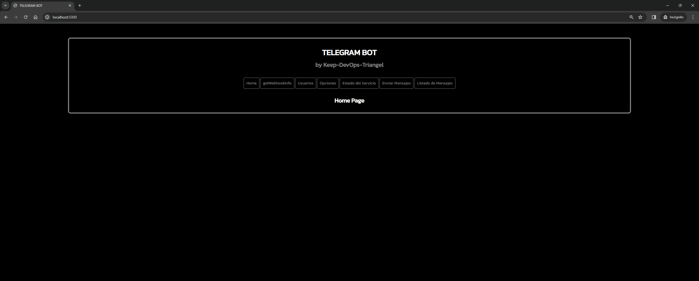
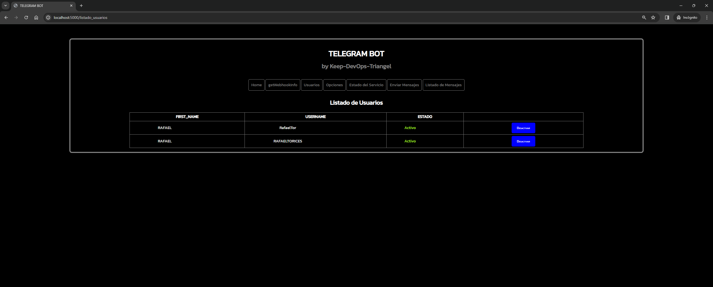
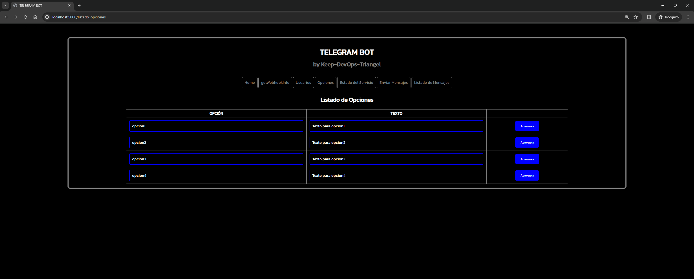
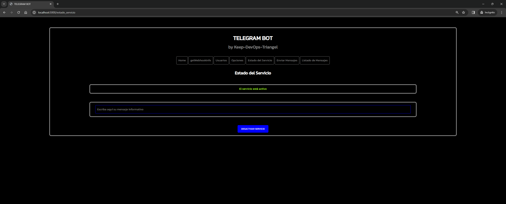
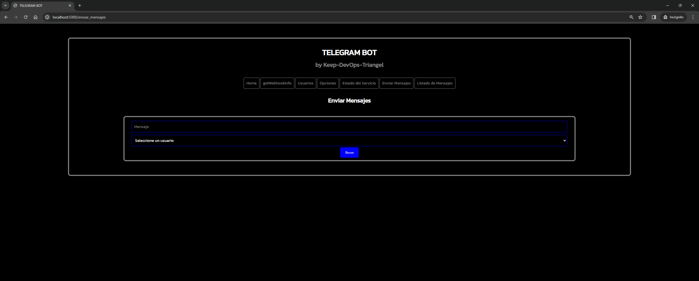
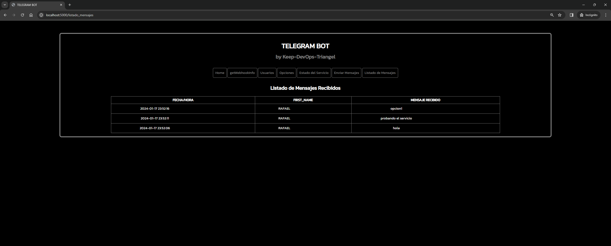
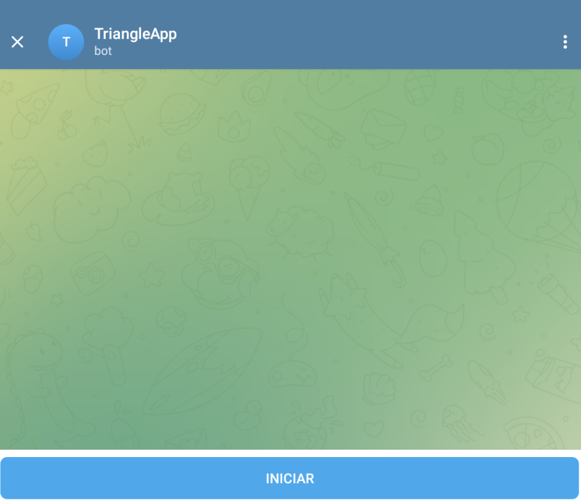
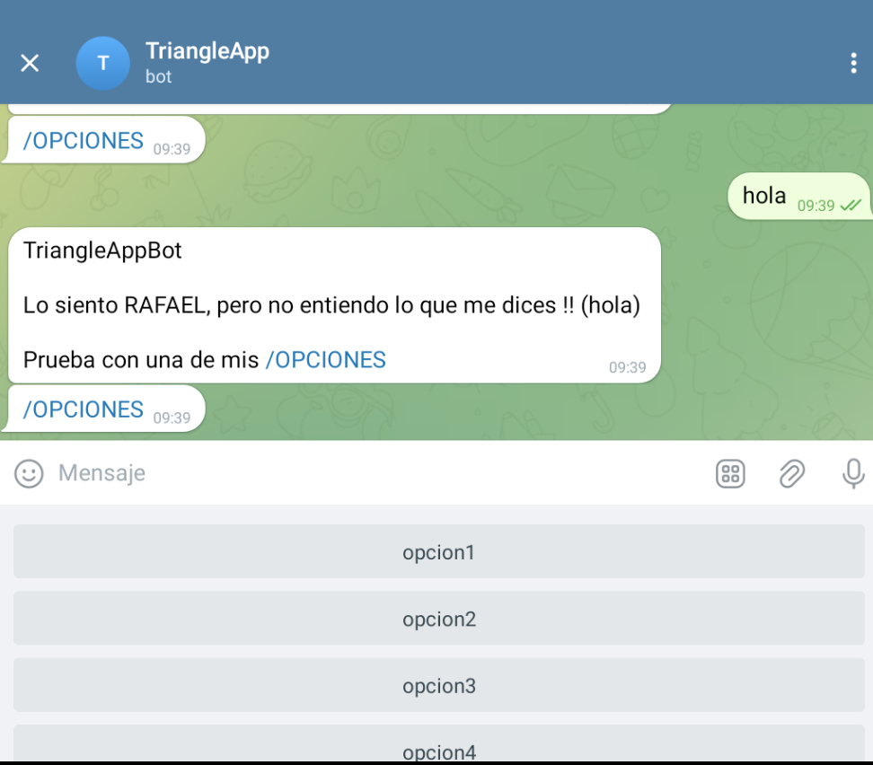
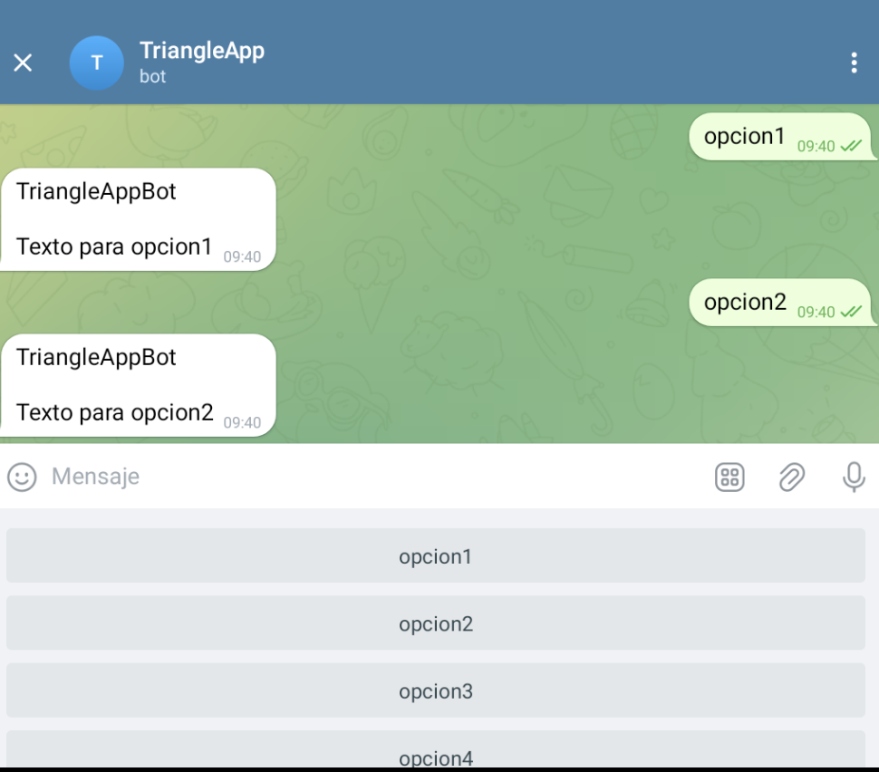

# Python Flask App with MySQL - Telegram Bot

## Introduction

App to create a Telegram Bot using official Telegram API ([python-telegram-bot](https://core.telegram.org/bots/api)). The app is developed using Python for the Bot service and communication with API Telegram, and Python Flask framework for the interface web. The database used is MySQL.

## Description

The app create a Telegram Bot that can be used to exchange information and messages between Bot and users through official Telegram app, responding to the options that the user selects in the Bot menu. This options are created by the admin user through the web interface. Also, the app has a web interface to manage the Bot and the users that can use it, and to see the messages that the users send to the Bot. Through the web interface, the admin user can activate or deactivate the Bot, authorize or block users, and see the messages that the users send to the Bot. All the information is stored in a MySQL database. Also, the app use Redis database to login in the web interface.

## Prerequisites

- Official Telegram account.
    - (https://web.telegram.org/k/)

- App Telegram configured into device.
     - (https://play.google.com/store/apps/details?id=org.telegram.messenger&hl=es&gl=US)
    - (https://apps.apple.com/es/app/telegram-messenger/id686449807)

- Bot Telegram created and token obtained from BotFather Telegram.
    - (https://t.me/botfather)
    - (https://core.telegram.org/bots#6-botfather)

- SSL certificate for the **URL WEBHOOK** of the Bot Telegram where our app is deployed.
    > This requirement is demanded by Telegram API to use the webhook that receive the requests from the Bot Telegram. For more information, see [Telegram](https://core.telegram.org/bots/api#setwebhook).

## Requirements technologies

- Python 3.10 or higher.
    - (https://www.python.org/downloads/)
- Python Flask framework for the web interface.
    - (https://pypi.org/project/Flask/)
- MySQL 8.0 for the database.
    - (https://dev.mysql.com/downloads/mysql/)
- Python mysql-connector-python for the connection with the database MySQL.
    - (https://pypi.org/project/mysql-connector-python/)
- > File **requirements.txt** with all the libraries, dependencies and versions used in the app.

## Project structure

- **config**: folder with the configuration files of the app.
    - **/mysql/db.sql**: File with the SQL script to create the database and the tables.

- **images**: folder with images used into documentation.

- **src**: folder with the source code of the app.
  - **application**: source code of the app web Python Flask.
    - **static**: static files of the application web.
      - **css**: CSS files of the application web.
    - **templates**: templates of the application web.
    - **api.py**: file with the methods for use the API Telegram.
    - **auth.py**: file with the methods for use the authentication of the web interface.
    - **config_app.py**: variables of configuration of the Bot.
    - **options.py**: functions of the options of the Bot.
    - **resp.py**: functions of the responses of the Bot.
    - **service.py**: service to manage the Bot.
    - **state_app.py**: control of the state of the Bot.
    - **users.py**: functions of the users of the Bot.
    - **web.py**: file with the methods for use the web interface.
    
  - **tests**: testing folder of the app.
    
  - **app.py**: main file of the app.

- **docker-compose.yml**: docker-compose file to deploy the app with Docker in local.

- **Dockerfile**: image Docker file to deploy the app with Docker in local.

- **env_example**: example file with the environment variables of the app.

- **README.md**: this file, with the documentation of the app.

- **requirements.txt**: requirements file with all the libraries, dependencies and versions used in the app.

## Deployment in local to development

> ### Once the requirements and requirements technologies are installed, follow the next steps to deploy the app in local to development:
> Note: Bot Telegram not can be used in local, because the **URL WEBHOOK** must be a public URL with SSL certificate and accessible from Internet to receive the requests from the Bot Telegram. For more information, see [Telegram](https://core.telegram.org/bots/api#setwebhook).
>
> -----

1. Clone the repository in local.

```bash
git clone
```

2. Create the environment variables file **env** with the environment variables of the app. Use the file **env_example** as example.

```bash
.env
```

3. Create an environment virtual with Python 3.10 or higher.

```bash
python3 -m venv venv
```

4. Activate the environment virtual.

```bash
source venv/bin/activate
```

5. Install the requirements of the app.

```bash
pip install -r requirements.txt
```

6. Create the database and the tables in MySQL with the SQL script **db.sql**.

``` Example with Docker:
docker run -d --name mysql -p 3306:3306 --env-file=.env mysql:8.0
docker exec -i mysql mysql -uroot -p$MYSQL_ROOT_PASSWORD < config/mysql/db.sql
```

7. Docker run Redis database.
```bash	
docker run -d --name redis -p 6379:6379 redis
```

8. Run the app.

```bash
python src/app.py
```

9. Open the app in the browser.

```bash
http://localhost:5000
```

## Deployment in local with Docker-compose

> ### **IMPORTANT**:
> File **.env** with the environment variables of the app is required to deploy the app with Docker-compose. Use the file **env_example** included in the repository as example.
> ### Variables environment:
>  - **URL_WEBHOOK**: Webhook URL of the Bot Telegram for requests. **(Required)**
>   - **API_TELEGRAM**: API Telegram URL. **(Required)**
>   - **TOKEN**: Token of the Bot Telegram. **(Required)**
>   - **TITULO_APP**: Title of the app. **(Required)**
>   - **TELEFONO_SOPORTE**: Phone number that is shown in the messages of the Bot. **(Optional)**
>   - **CHAT_ID_SOPORTE**: Chat ID of the admin user of the Bot Telegram. **(Required)**
>     - To obtain it, we can use the Telegram Bot [@userinfobot](https://t.me/userinfobot). When we start it, it will show us our CHAT_ID.
>   - **EMAIL_SOPORTE**: Contact email that is shown in the messages of the Bot. **(Optional)**
>   - **WEB_USERNAME**: Username of the admin user of the web interface. **(Required)**
>   - **WEB_PASSWORD**: Password of the admin user of the web interface. **(Required)**
> --------

> ### - Variables environment of the database MySQL:
>   - **MYSQL_DATABASE** - **(REQUIRED)**
>   - **MYSQL_USER** - **(REQUIRED)**
>   - **MYSQL_PASSWORD** - **(REQUIRED)**
>   - **MYSQL_HOST** - **(REQUIRED)**
>   - **MYSQL_PORT** - **(REQUIRED)**
>   - **MYSQL_ROOT_PASSWORD** - **(REQUIRED)**
> ------

> ### - Variables environment of the Redis database:
>   - **REDIS_HOST** - **(REQUIRED)**
> ------

### Once configured the environment variables, follow the next steps to deploy the app in local with Docker-compose:

1. Clone the repository in local.

```bash
git clone
```

2. Create the environment variables file **env** with the environment variables of the app. Use the file **env_example** as example.

```bash
.env
```

3. Run the app with Docker-compose.

```bash
docker-compose up -d
```

4. Open the app in the browser.

```bash
http://localhost:5000
```

5. Stop the app with Docker-compose.

```bash
docker-compose down
```

## App working

### Bot Telegram

- Search the Bot Telegram in the official Telegram app for name defined in the environment variable **TITULO_APP**.
- Start the Bot Telegram with the command **/start**.
- First, the Bot show welcome message and inform to the admin user that new user must be authorized to use the Bot.
- The admin user (defined in the environment variable **CHAT_ID_SOPORTE**) receive a message with the new user that want to use the Bot. The admin user can authorize or block the user through the web interface or through the Bot Telegram.
- If the admin user authorize the user, the user can use the Bot Telegram. Can see the options that the admin user has created in the web interface, and can select one of them to send a message to the Bot Telegram.
- If the admin user block the user, the user can't use the Bot Telegram. The user receive a message that inform that the admin user has blocked him.
- The admin user can see the messages that the users send to the Bot Telegram through the web interface.
- If the user send a message that not is an option, the Bot Telegram show a message that inform that the message is not an option and show the options that the user can select.
- If the user not is authorized, the Bot Telegram show a message that inform that the user is not authorized and can't use the Bot Telegram.

### Bot Telegram commands available for the admin user

The admin user (defined in the environment variable **CHAT_ID_SOPORTE** and defined in **src/application/resp.py**) can use the next commands in the Bot Telegram:

- **ACTIVATE_SERVICE**: activate the Bot Telegram service.
- **DEACTIVATE_SERVICE**: deactivate the Bot Telegram service.
- **LIST_USERS**: show the list of users that can interact with the Bot Telegram.
- **LIST_USERS_PENDING**: show the list of users that are pending of authorization to use the Bot Telegram.
- **LIST_USERS_AUTHORIZED**: show the list of users that are authorized to use the Bot Telegram.

### Web interface

- Access to the web interface in the browser with the URL defined in the environment variable **URL_WEBHOOK**.
- Login in the web interface with the username and password defined in the environment variables **WEB_USERNAME** and **WEB_PASSWORD**.
- The admin user can see the messages that the users send to the Bot Telegram.
- The admin user can see the users that use the Bot Telegram.
- The admin user can authorize or block the users that use the Bot Telegram.
- The admin user can activate or deactivate the Bot Telegram.
- The admin user can edit the four options that the users can select in the Bot Telegram.
- The admin user can send a message to the users that use the Bot Telegram.

### Options in the web interface

- **WebhookInfo**: show the information of the webhook of the Bot. From this option you can get the information of the webhook, set a new one, delete it or update it.
- **Uers**: show the list of users that can interact with the Bot and their status. From this option you can activate/deactivate users.
- **Options**: show the list of options available for the Bot. From this option you can edit the available options that are shown in the Telegram app.
- **Service**: show the status of the Bot service. From this option you can activate/deactivate the Bot service. If you deactivate the service (indicate reason in the text area), the users that interact with the Bot will receive a message informing them that the service is deactivated and they will not be able to interact with the Bot. If you activate the service, the users that interact with the Bot will receive a message informing them that the service is activated and they will be able to interact with the Bot.
- **Send Messages**: option to send direct messages to the users that can interact with the Bot.
- **List Messages**: list of messages that the users send to the Bot.

## Preview images of the app

### Web interface

  

  

  

  

  

  

  ### Bot in App Telegram

  

  

  

## Sources

- https://core.telegram.org/bots/api
- https://python-telegram-bot.readthedocs.io/en/stable/
- https://flask.palletsprojects.com/en/2.0.x/
- https://dev.mysql.com/doc/connector-python/en/
- https://docs.docker.com/compose/
- https://www.docker.com/get-started/
- https://www.python.org/
- https://www.mysql.com/
