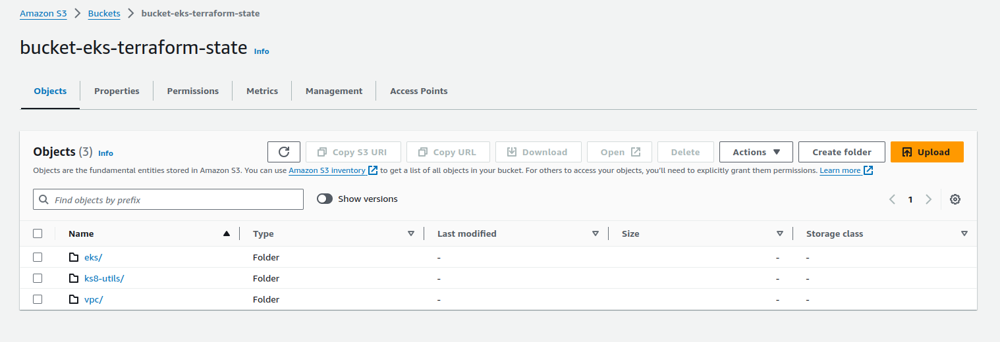

# Keep-DevOps-Triangel-app

## Cluster Elastik Kubernetes Services para app triangle!

pasos para lanzar la infra

1: entrar en la carpeta vpc y ejecutar
  terraform init
  terraform plan
  terraform apply

2: entrar en la carpeta eks y ejecutar 
  terraform init
  terraform plan
  terraform apply

para ejecutar el cluster en local, al finalizar la creacion del cluster saldra un output con este codigo:

rm $HOME/.kube/config ; aws eks update-kubeconfig --name cluster-eks-tf

copiar y pegar y ejecutar en terminal y podreis conectaros al cluster 


3: entrar en la carpeta ks8-utils y ejecutar 

  terraform init
  terraform plan
  terraform apply

esta ultima levanta en el cluster un load balance controler con con politica AIM 


borrador de la doc del codigo***

para la facilidad de mantenimiento de codigo, se decice usar modulos mantenidos por AWS

### VPC

  
- The `vpc.tf` file in Terraform is used to define a VPC (Virtual Private Cloud) module in AWS (Amazon Web Services). This module is responsible for creating and configuring a VPC in AWS with the provided specifications.


This module will create a VPC with the provided specifications and apply the corresponding tags to the VPC and subnets.

```hcl
  module "vpc" {
  source = "terraform-aws-modules/vpc/aws"
  }
  ```

  It provisions a VPC with the specified name and CIDR block.

  ```hcl
  name = "vpc-eks-tf"
  cidr = "10.0.0.0/16"
  ```

  It also creates three availability zones (AZs) and configures private and public subnets within each AZ

```hcl
  azs             = ["eu-central-1a", "eu-central-1b", "eu-central-1c"]
  private_subnets = ["10.0.1.0/24", "10.0.2.0/24", "10.0.3.0/24"]
  public_subnets  = ["10.0.101.0/24", "10.0.102.0/24", "10.0.103.0/24"]
```

  NAT gateway is enabled for outbound internet access
  from private subnets, while VPN gateway is disabled.

```hcl
  enable_nat_gateway = true
  enable_vpn_gateway = false
```

The module applies tags to the VPC and subnets for identification and organization purposes.

```hcl
  tags = {
    Terraform   = "true"
    Environment = "dev"
    repo_url    = "https://github.com/Keep-DevOps-Triangel/Keep-DevOps-Triangel-app"
  }

  public_subnet_tags = {
    "kuberetes.io/role/elb"             = "1"
    "kuebernetes.io/cluster/vpc-eks-tf" = "shared"
  }

  private_subnet_tags = {
    "kuberetes.io/role/internal-elb"    = "1"
    "kuebernetes.io/cluster/vpc-eks-tf" = "shared"
  }
```

## Module Outputs:

The `outputs.tf` file in Terraform is used to define the values that will be exported as a result of running a module. These values, called outputs, can be used by other modules or by the Terraform code that calls the module.

This output will export the ID of the VPC that is created with the `vpc` module.

```hcl
output "vpc_id" {
  value = module.vpc.vpc_id
}
```

This output will export the list of private subnets that are created with the `vpc` module.

```
output "private_subnets" {
  value = module.vpc.private_subnets
}
```


## Remote state
  -  The `remote_state.tf` file in Terraform is used to configure the Terraform backend. A backend in Terraform determines how the Terraform state is stored and accessed.

Storing the Terraform state in a remote backend like S3 allows multiple people and systems to work with the same Terraform code without conflicts, as everyone can access and update the Terraform state centrally. It also provides an additional layer of security and durability, as the Terraform state can contain sensitive information and is crucial for the correct operation of Terraform.


```hcl
terraform {
  backend "s3" {
    bucket = "bucket-eks-terraform-state"
    key    = "vpc/terraform.tfstate"
    region = "eu-central-1"
  }
}
```



para ejecutar este direcotirio 


# Clustet Elastik Kubernetes services

- This Terraform (.tf) file uses the eks module from the terraform-aws-modules/eks/aws repository to create an Amazon EKS (Elastic Kubernetes Service) cluster on AWS. Let's break down the key configurations:

Module Configuration for EKS:

```hcl
Copy code
module "eks" {
  source  = "terraform-aws-modules/eks/aws"
  version = "~> 18.0"
  ...
}
```
Description: The eks module from the Terraform Module Registry is used to simplify the creation and management of the Amazon EKS cluster.
version: Specifies the version of the module to be used (approximately version 18.0).
EKS Cluster Configuration:


```hcl
Copy code
cluster_name    = "cluster-eks-tf"
cluster_version = "1.25"
...
```
Description: Configures specific parameters for the EKS cluster.
cluster_name: Name of the cluster.
cluster_version: Version of Kubernetes to be used in the cluster.
Cluster Access Configuration:


```hcl
Copy code
cluster_endpoint_private_access = true
cluster_endpoint_public_access  = true
...
```
Description: Enables both private and public access to the cluster.
VPC and Subnet Configuration:

```hcl
Copy code
vpc_id     = data.terraform_remote_state.vpc.outputs.vpc_id
subnet_ids = data.terraform_remote_state.vpc.outputs.private_subnets
...
```
Description: Specifies the VPC and private subnets where the EKS cluster will be deployed.
vpc_id: Obtained from the remote Terraform state containing VPC information.
subnet_ids: Obtained from the remote Terraform state containing private subnets.
Additional Security Rules for Node Groups:

```hcl
Copy code
node_security_group_additional_rules = {
  ingress_allow_access_from_control_plane = {
    type                          = "ingress"
    protocol                      = "tcp"
    from_port                     = 9443
    to_port                       = 9443
    source_cluster_security_group = true
    description                   = "Allow access from control plane to webhook port of AWS load balancer controller"
  }
}
...
```

Description: Adds an additional security rule to the node group of the cluster.
Managed Node Groups Configuration:

```hcl
Copy code
eks_managed_node_groups = {
  group1 = {
    min_size     = 1
    max_size     = 3
    desired_size = 1

    instance_types = ["t3.large"]
  }
}
...
```
Description: Configures a managed node group with a range of sizes and instance types.
Fargate Profiles Configuration:

```hcl
Copy code
fargate_profiles = {
  fg-developers-triangel = {
    name = "fg-developers-triangel"
    selectors = [
      {
        namespace = "fg-developers-triangel"
      }
    ]
  }
}
...
```
Description: Configures a Fargate profile to run specific workloads on Fargate.
Tags:

```hcl
Copy code
tags = {
  Environment = "dev"
  Terraform   = "true"
}
```
Description: Assigns tags to the EKS cluster to help organize and categorize resources.


